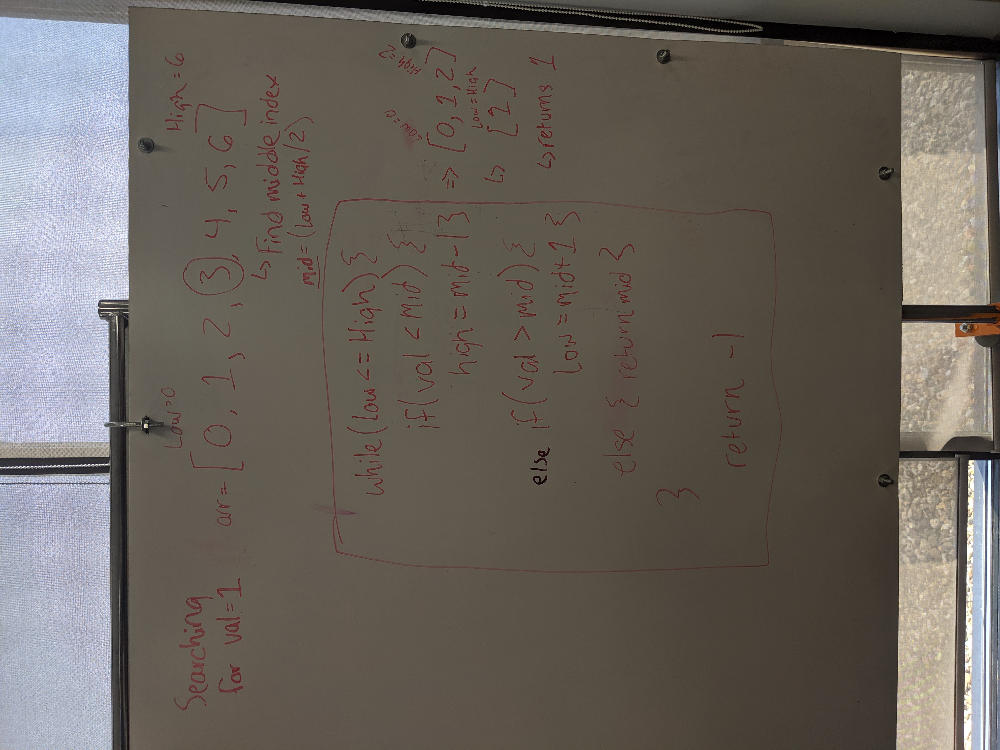

# Challenge Summary
Create a binary search algorithm.

## Challenge Description
Write a function called BinarySearch which takes in 2 parameters: a sorted array and the search key. Without utilizing any of the built-in methods available to your language, return the index of the array’s element that is equal to the search key, or -1 if the element does not exist.

## Approach & Efficiency
I set a low and a high value (the 1st index of the array and the last index). I created a loop while the low value is less than or equal to high value. In the while loop it calculates the mid-index. If the searched value (key) is less than or greater than the array value of the mid-index then it will narrow the search range to the half above/below the mid-index. It continually splits the search field in half until the key value is found or if not found then returns -1.

## Solution
