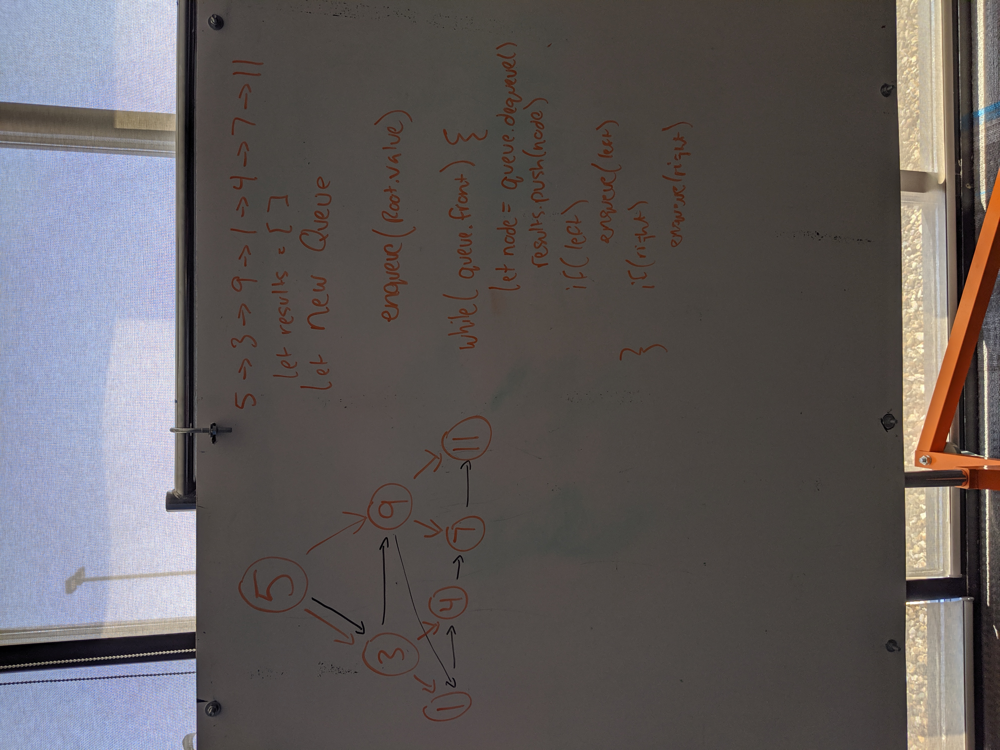

# Challenge Summary
Breadth-first Traversal of a tree.

## Challenge Description
* Write a breadth first traversal method which takes a Binary Tree as its unique input. Without utilizing any of the built-in methods available to your language, traverse the input tree using a Breadth-first approach; print every visited node’s value.

## Approach & Efficiency
I utilized a queue to enqueue/dequeue the values as I traversed through the tree.

## Solution

