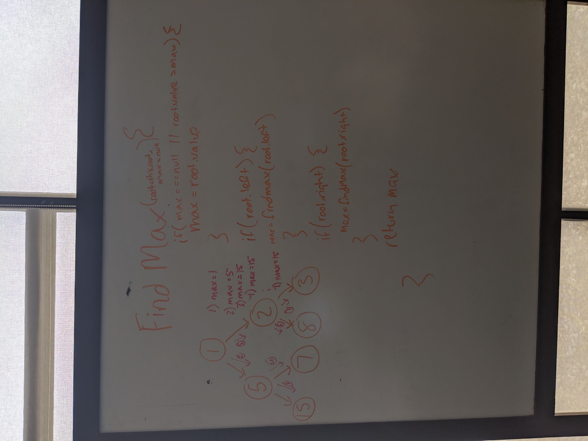

# Challenge Summary
Find the Maximum Value in a Binary Tree

## Challenge Description
* Write an instance method called find-maximum-value. Without utilizing any of the built-in methods available to your language, return the maximum value stored in the tree. You can assume that the values stored in the Binary Tree will be numeric.

## Approach & Efficiency
I used a recursive function to traverse through each node while comparing each node value with a stored max value. Once every node has been traversed the max value from all the nodes is returned.

Time Efficiency - O(N)
* The function traverses through every node once to compare the value with the previous max value

## Solution
