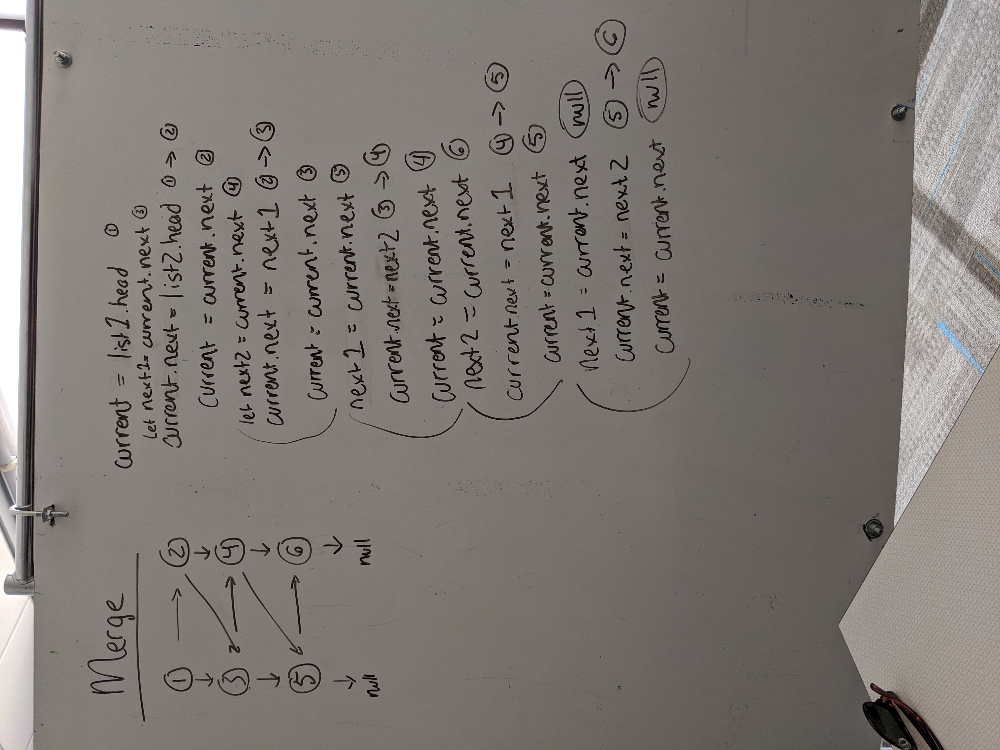

# Merging Linked Lists
Merge two linked lists.

## Challenge
Write a function called `mergeLists` which takes two linked lists as arguments. Zip the two linked lists together into one so that the nodes alternate between the two lists and return a reference to the head of the zipped list. Try and keep additional space down to O(1).

## Approach & Efficiency
I used a while loop to traverse through both lists with a   `runner` that points the value of list1 to list2 for each iteration of the loop. I used `list1` and `list2` to store head/next for each list while moving traversing the lists.

Efficiency: O(n)
Space: O(1)

## Solution
